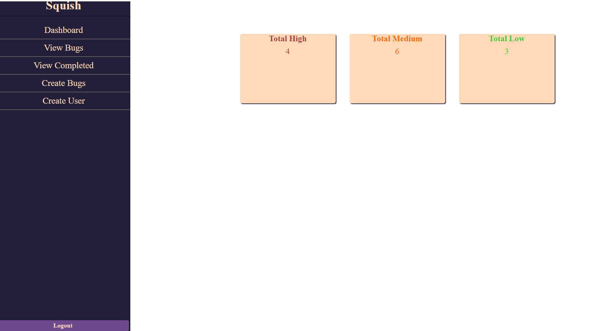
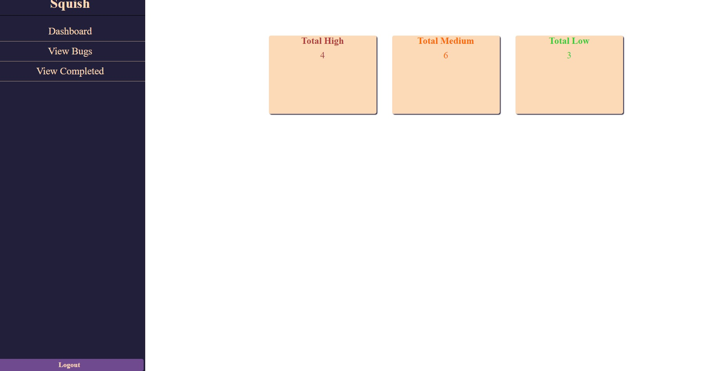

# Squish 

## [Live App](https://bug-tracker-lhdmt61az.vercel.app/)

A bug tracker that allows for creating, updating, and marking bugs complete. As well as creating new users that have access to bugs that you create.

## Motivation

I wanted an app that allowed me to track bugs in my own projects and organize them in an easy to use way.

## Summary

Users can try out the app with the username 'admin' and password of 'admin' to see how the admin view works.
It allows you to view all bugs, create new bugs and users, and mark bugs as completed.
Users can also log in with the username 'user' and password of 'user' to see how the user view works.
It allows for viewing and completion of bugs but it can't create new bugs or users.

## Screenshots
Admin View

User View

## Technologies

- JavaScript
- React
- Node.js
- Express
- PostgreSQL
